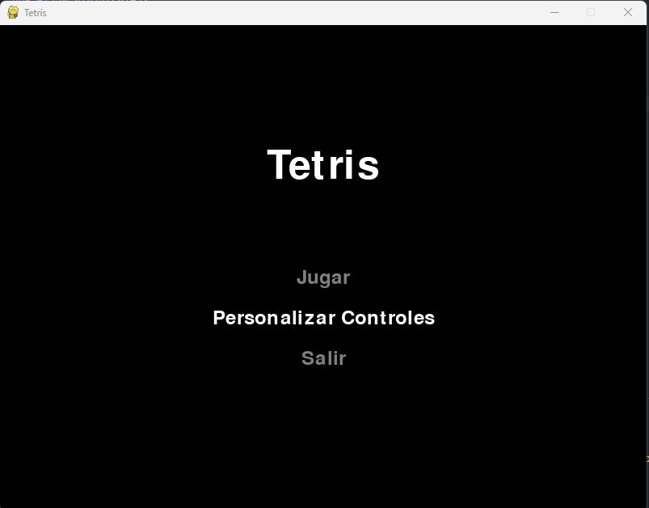
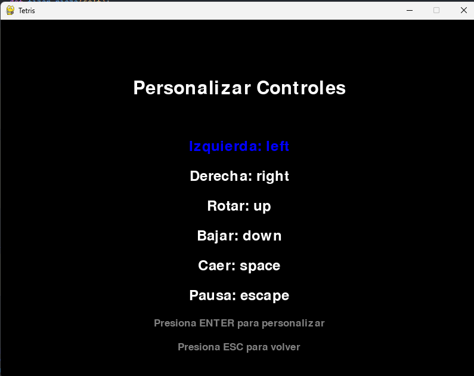
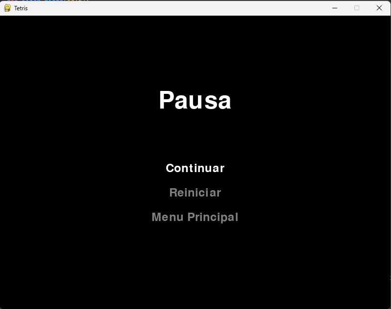
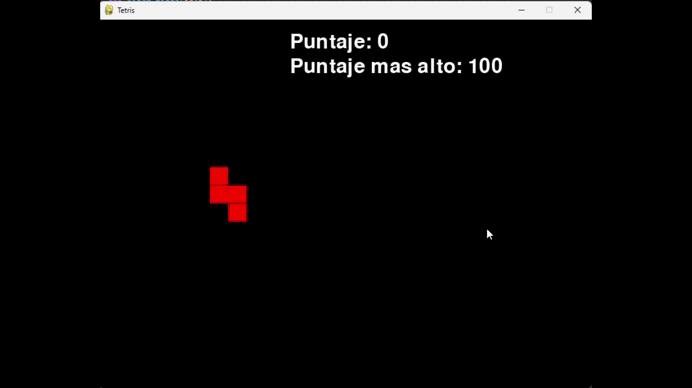

# Tetris en Python
Un clásico juego de Tetris implementado en Python utilizando la biblioteca Pygame.

## Descripción
Este proyecto es una recreación del icónico juego Tetris. Los jugadores deben manipular piezas que caen (tetrominós) para crear líneas completas y evitar que las piezas lleguen a la parte superior del tablero.

## Capturas

### Menu principal

### Controles

### Menu de pausa

### Juego

## Características
- Diferentes tipos de tetrominós con colores únicos
- Sistema de puntuación
- Guardado de puntuación más alta
- Menú principal interactivo
- Personalización de controles
- Menú de pausa con opciones para continuar, reiniciar o volver al menú principal
- Velocidad de caída ajustable

## Requisitos
- Python 3.x
- Pygame

## Controles predeterminados
- Flecha izquierda: Mover pieza a la izquierda
- Flecha derecha: Mover pieza a la derecha
- Flecha arriba: Rotar pieza
- Flecha abajo: Acelerar caída
- Barra espaciadora: Caída instantánea
- ESC: Pausar juego

## Cómo jugar
1. Ejecuta el script Python
2. Usa el menú principal para:
   - Iniciar un nuevo juego
   - Personalizar los controles
   - Salir del juego
3. Durante el juego:
   - Manipula las piezas que caen para crear líneas completas
   - Gana puntos al completar líneas
   - El juego termina cuando las piezas alcanzan la parte superior del tablero

## Características técnicas
- Implementación de clases para las piezas y el juego
- Sistema de colisiones
- Rotación de piezas
- Guardado de configuración en archivos JSON y TXT
- Menús interactivos con selección mediante teclado

## Personalización
El juego permite personalizar todos los controles a través del menú "Personalizar Controles", ofreciendo una experiencia de juego adaptada a las preferencias del usuario.

## Estructura del proyecto
- Clase `Pieza`: Maneja la lógica de las piezas individuales
- Clase `Tetris`: Controla la lógica principal del juego
- Funciones de dibujo para renderizar el tablero y las piezas
- Sistema de menús interactivos
- Manejo de eventos para controles y pausas

## Guardado de datos
El juego guarda la puntuación más alta en:
- Un archivo de texto plano (Configuraciones/Puntaje.txt)
- Un archivo JSON (Configuraciones/Puntaje.json)